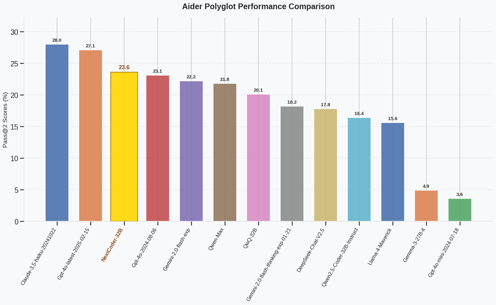

# NextCoder

<p align="center">
        🤗 <a href="https://huggingface.co/collections/microsoft/nextcoder-6815ee6bfcf4e42f20d45028">Hugging Face</a>&nbsp&nbsp | &nbsp&nbsp 📑 <a href="https://arxiv.org/abs/2503.03656">Arxiv</a> 
</p>

## Introduction
This repository hosts the official code and data artifact for the paper [NextCoder: Robust Learning of Diverse Code Edits
](https://arxiv.org/abs/2503.03656)

The work is the development of code-editing LLMs, synthetic data generation pipeline and a novel finetuning methodology called **Selective Knowledge Transfer (SeleKT)**.

## Repository Structure
- [data](data/): contains the scripts and files required to generate synthetic dataset for code-editing as per the pipeline proposed in the paper
- [train](src/train/) contains the scripts and files for finetuning with SeleKT, LoRA and usual SFT.

## Model Usage
```python
from transformers import AutoModelForCausalLM, AutoTokenizer

model_name = "microsoft/NextCoder-7B"

model = AutoModelForCausalLM.from_pretrained(
    model_name,
    torch_dtype="auto",
    device_map="auto"
)
tokenizer = AutoTokenizer.from_pretrained(model_name)

prompt = """
Fix the following function that divides two numbers to handle all the edge cases:

def divide(a, b)
  returm a/b
"""
messages = [
    {"role": "user", "content": prompt}
]
text = tokenizer.apply_chat_template(
    messages,
    tokenize=False,
    add_generation_prompt=True
)
model_inputs = tokenizer([text], return_tensors="pt").to(model.device)

generated_ids = model.generate(
    **model_inputs,
    max_new_tokens=1024
)
generated_ids = [
    output_ids[len(input_ids):] for input_ids, output_ids in zip(model_inputs.input_ids, generated_ids)
]

response = tokenizer.batch_decode(generated_ids, skip_special_tokens=True)[0]
```

## Evaluation and Performance


*Comparison of NextCoder-32B models with other models*

| Models | HUMANEVALEDIT | CANITEDIT | AIDER | POLYGLOT |
|--------|---------------|-----------|-------|----------|
| QwenCoder-2.5-3B | 73.2 | 37.1 | 36.8 | - |
| QwenCoder-2.5-3B-LoRA | 64.6 | 36.2 | 35.8 | - |
| QwenCoder-2.5-3B-SFT | 76.2 | 32.4 | 30.1 | - |
| **NextCoder-3B** | 75.6 | 42.4 | 37.6 | - |
| QwenCoder-2.5-14B | 87.8 | 58.1 | 66.9 | 9.3 |
| QwenCoder-2.5-14B-LoRA | 78.0 | 50.9 | 66.2 | 5.3 |
| QwenCoder-2.5-14B-SFT | 79.9 | 42.4 | 36.8 | 3.1 |
| **NextCoder-14B** | 89.8 | 60.2 | 72.2 | 12.2 |
| QwenCoder-2.5-32B | **90.2** | 61.0 | 72.9 | 16.4 |
| QwenCoder-2.5-32B-LoRA | 82.3 | 52.4 | 60.2 | 6.7 |
| QwenCoder-2.5-32B-SFT | 81.7 | 49.5 | 66.9 | 8.4 |
| **NextCoder-32B** | 88.9 | **62.4** | **74.7** | **23.6** |

*Comparison of base QwenCoder-2.5 models of different sizes and their SELEKT-enhanced versions across three code editing benchmarks.*

</img>


| Model | MMLU | GSM8K | HumanEval+ | MBPP+ |
|-------|------|-------|------------|-------|
| Qwen2.5-Coder-7B-Instruct | 53.0 | 83.40 | 85.4 | 72.5 |
| NextCoder-7B | 54.5 | 81.65 | 84.8 | 72.0 |
| Qwen2.5-Coder-32B-Instruct | 71.9 | 93.71 | 87.2 | 76.7 |
| NextCoder-32B | 72.7 | 92.65 | 85.9 | 76.4 |

*Generalization properties kept across different benchmarks among base and nextcoder versions*


**A detailed evaluation and ablations can be found in our paper**

## Contributing

This project welcomes contributions and suggestions.  Most contributions require you to agree to a
Contributor License Agreement (CLA) declaring that you have the right to, and actually do, grant us
the rights to use your contribution. For details, visit https://cla.opensource.microsoft.com.

When you submit a pull request, a CLA bot will automatically determine whether you need to provide
a CLA and decorate the PR appropriately (e.g., status check, comment). Simply follow the instructions
provided by the bot. You will only need to do this once across all repos using our CLA.

This project has adopted the [Microsoft Open Source Code of Conduct](https://opensource.microsoft.com/codeofconduct/).
For more information see the [Code of Conduct FAQ](https://opensource.microsoft.com/codeofconduct/faq/) or
contact [opencode@microsoft.com](mailto:opencode@microsoft.com) with any additional questions or comments.

## Trademarks

This project may contain trademarks or logos for projects, products, or services. Authorized use of Microsoft 
trademarks or logos is subject to and must follow 
[Microsoft's Trademark & Brand Guidelines](https://www.microsoft.com/en-us/legal/intellectualproperty/trademarks/usage/general).
Use of Microsoft trademarks or logos in modified versions of this project must not cause confusion or imply Microsoft sponsorship.
Any use of third-party trademarks or logos are subject to those third-party's policies.

## Citation

```bibtex
@inproceedings{aggarwal2025nextcoder,
author = {Aggarwal, Tushar and Singh, Swayam and Awasthi, Abhijeet and Kanade, Aditya and Natarajan, Nagarajan},
title = {NextCoder: Robust Adaptation of Code LMs to Diverse Code Edits},
booktitle = {International Conference on Machine Learning},
year = {2025},
url = {https://www.microsoft.com/en-us/research/publication/nextcoder-robust-adaptation-of-code-lms-to-diverse-code-edits/},
}
```